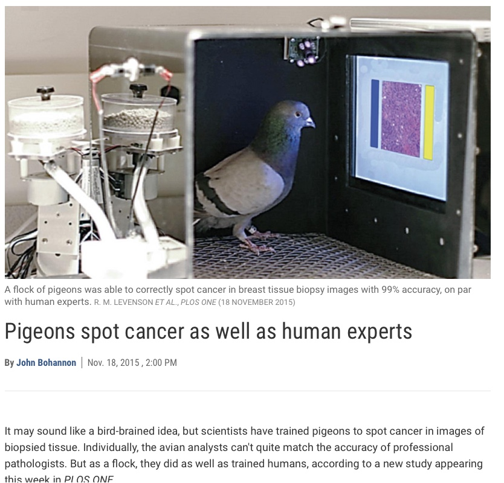

```{r setup, include=FALSE}
options(htmltools.dir.version = FALSE)
library(xaringanthemer)
solarized_dark(
  code_font_family = "Fira Code",
  code_font_url    = "https://cdn.rawgit.com/tonsky/FiraCode/1.204/distr/fira_code.css"
)
```

class: inverse, center, middle

# ¿Qué es Inteligencia Artificial?

---
class: center, middle


---
class: center, middle

j
---
class: inverse, center, middle
# ¿Qué es Inteligencia?

---

# Más allá del concepto

Las mediciones determinan la posición del individuo en la población en función de la edad y su desempeño.


--

Ni siquiera es estable en el tiempo.

---
# Más allá del concepto

### Primera Guerra Mundial 

 - test army α
 
--

 - test army β

--
 
Avances en algebra matricial y analisis factorial. Correlación, un factor general G, y tantos como factores se midan

---
# Más allá del concepto

### Segunda Guerra Mundial.

 - Baterias de aptitud múltiple o pruebas diferenciales.
 
--

 - Se miden factores mucho más específicos para tareas especializadas de modo que se pueden seleccionar pilotos, artilleros, operadores de radio...

--

 - Army Standard Scores:
    - Aircrew classification battery
    - Army general classification
    - Armed forces qualification test


---
# Críticas

  - Sesgos Culturales

--

  - Racismo?
  
--
  
  - Conformismo Social
  
--

### Paradojas de la Guerra ......

---

## El Concepto

 - Jerry Fodor y la Modularidad fisiológica (1980): 
                parece que existen módulos específicos por tarea.
 .pull-right[] 

---

## El Concepto

 - Howard Gardner y las Inteligencias múltiples (1983):
 
    Lengua, matemática, espacial, musical, cinestésica, intrapersonal/interpersonal, +naturalista
    
  .pull-right[] 

---

## El Concepto

 - Daniel Goleman: 
        inteligencia emocional (1995), social y ecológica
 
   .pull-right[]
   
---
class: inverse, center, middle
## Paradoja de la Inteligencia

**_Sí el cerebro fuese tan sencillo como para que lo pudiésemos comprender seríamos tan estúpidos que seríamos incapaces de hacerlo_**

---
class: inverse, center, middle
## Paradoja

**_"Somos emociones, y tenemos personas."_**

                       Mariano Rajoy

         
---
class: inverse, center, middle

# Entonces...
# ¿Qué es Inteligencia Artificial?

---
## ¿Qué es Inteligencia Artificial?

 - La respuesta que demos estara siempre condicionada por el proposito, la ideologia y los temores.

---
## ¿Qué es Inteligencia Artificial?

- Conferencia de Darthmouth en 1956 (**_McCarthy, Minsky, Shannon y Rochester_**)


---
## ¿Qué es Inteligencia Artificial?

 -  Vamos a hacer el camino a la inversa: ¿Qué existe que se ajuste a lo que consideramos inteligencia?
 
---
## Capacidad Matemática

<div align="center"></div> 

---
## Capacidad Matemática


---
## Capacidad Matemática


---
## Capacidad Linguística

 - Reconocimiento del texto escrito
 - Reconocimiento + Traducción
 
   .pull-right[]
   

--

 - Clasificacion de los documentos por temas
 
--

 - Analisis del sentimiento del discurso
 
--

 - Gramática Generativa: Creación de discurso inteligible


---
## Capacidad Espacial

_DARPA Grand Challenge (2004): 1 millón de dólares. Ruta de 180 kilómetros por terreno accidentado. NInguno pasó de 10 Km. Al año siguiente lo lograron 5_


---
class: center, middle


---
## Capacidad Espacial


.footnote[
[1] Self Driven Cars taught by poor kenyans] https://www.bbc.co.uk/news/amp/technology-46055595
---
## Capacidad Cinestésica


.footnote[
[2] Boston Dynamics. Atlas Parkour]https://www.youtube.com/watch?v=QCTSrJscmBg

---
## Capacidad Cinestésica


.footnote[
[3] Boston Dynamics. Atlas BackFlip]https://www.youtube.com/watch?v=fRj34o4hN4I

---
## Objeción

 - Hacen aquello para lo que han sido programados.
 
--
 
 - No presentan creatividad. No tienen capaciad de crear algo nuevo.

---
## Capacidad Musical


.footnote[
[4] Deep Bach] https://www.abc.es/tecnologia/informatica/abci-inteligencia-artificial-crea-musica-estilo-bach-201801242152_noticia.html

---
## Capacidad Artística


.footnote[
[5] Rembrandt IA] https://es.gizmodo.com/una-inteligencia-artificial-pinta-un-nuevo-cuadro-de-re-1769869684

---
## Capacidad Artística


.footnote[
[6] La IA planta cara al arte] https://elpais.com/cultura/2018/10/26/actualidad/1540577952_910752.html

---
## Objeción

 - No aprenden por sí solos.
 
--
 
 - Solamente "imitan".

---
## Aprendizaje autónomo

**Alpha Go / Alpha Zero**


---
# Alpha Go

 - Set de Training de Alpha Go v1= 30 millones de partidas (1 mes)
 
--

 - Set de Training de Alpha Go v2=  5 millones de partidas (70 horas)

--
 
 - **Go Zero : **
    - **sin set de training. Jugaba contra sí mismo. (4 horas)**

---
# Redes Neuronales

¿Cómo podemos entender cómo funciona un cerebro real?


McCulloch y Pitts (1943) postulan la posibilidad de que modelar matemáticamente el cerebro pudiese conducir a avances en el tratamiento de trastornos psiquiátricos. (No existen computadoras programables en ese momento.)

---
# Redes Neuronales
 - 86 mil millones de neuronas 
 - 8 tipos según diversa química
 - 6 tipos según morfología y funcionalidad (hasta 27 tipos según otras clasificaciones)


---
# Redes Neuronales


---
# Redes Neuronales

**DNN**


--

Textos e Imágenes. Muy pesada.

---
# Redes Neuronales

**CNN**


--

Detección de patrones. Procesamiento de imágenes.

---
# Redes Neuronales

**RNN**


--

Datos secuenciales (texto, series temporales: bolsa)

---
# Redes Neuronales

**GANs**


---
# Redes Neuronales


---
class: inverse, middle, center

**_Métodos estadísticos simples con suficiente volumen de datos, son capaces de aparentar comprensión e intuición._**

---
class: middle, center



---
# Palomas Expertas

 - Una paloma consigue el 80% de accuracy en un mes. Un enfermero tarda 6 meses de entrenamiento.

--

 - Un cluster de palomas consigue el 99%.
 

Más referencias: 

https://www.youtube.com/watch?v=OWUDqmlY19A

https://www.slideshare.net/juantomas/databeers-madrid-2017-paas-pigeons-as-a-service

https://journals.plos.org/plosone/article?id=10.1371/journal.pone.0141357

---
# Logros

- La Universidad de California en Berkeley, usa técnicas de Machine Learning para leer mentes. (No Lie MRI)

--

- Terapia emocional con veteranos de guerra.

--

- Cuidado de ancianos (Japón), eliminación de plagas con minibots.

--

- Opportunity / Curiosity / Fukushima

--

- En la dicotomía `razonamiento simbólico vs. Machine Learning` el énfasis de la IA se ha puesto en el segundo cuando pensar es más cercano a lo primero.

---
class: inverse, middle, center
# Paradoja de la Inteligencia Artifical

**Cuando algo que se considera Inteligencia Artificial, es alcanzado, deja de considerarse Inteligencia Artificial**

---
# Las palabras no son innocentes

 - Si en lugar de IA, McCarthy hubiese utilizado `Procesamiento simbólico`, `Computación analítica`, o cualquier otra expresión, no estaríamos hablando de esto.
 
--

 - Poniendo un ejemplo absurdo, si los aviones se hubiesen llamado "Pájaros Mecánicos", en algún momento se hubiera discutido qué ocurriría cuando decidieran poner huevos.
 
--

 - Otro ejemplo absurdo más. El Submarino
 
---
class: inverse, middle, center
# Sin embargo....

---
# Sin embargo....


---
# Sin embargo....


---
# Sin embargo....


---
# Ya se dijo...

**_“Actualmente, las máquinas resuelven problemas de acuerdo con los principios que hemos establecidos en ellas. Dentro de poco quizá aprendamos a ponerlas a trabajar en problemas específicos de mejorar su capacidad de resolver problemas. Una vez traspasado cierto umbral, esto nos llevaría a una espiral de aceleración y sería difícil perfeccionar un regulador fiable para refrenarlo”._**

                                                            Marvin Minsky
---
# Cuestiones y provocaciones


---
# Cuestiones y provocaciones
- **¿Puede una IA llegar a ser más inteligente que un ser humano?**

Si, pero en formas restringidas.

--

- **¿"por dentro" hace lo mismo?**

Y si el resultado final es el mismo, ¿importan algo las diferencias?

--

- **¿Tienen o tendrán mente las IA?** IA “fuerte” frente a IA “débil” (`Intrapersonal/Interpersonal`)

la IA fuerte afirma tienen, o llegarán a tener. La IA débil afirma que simplemente simulan. ¿actúan "cómo si"? El juego de imitación de Turing. Depende de las creencias que tenemos sobre nosotros mismos, por ejemplo ¿existe el alma? ¿los eventos mentales son de algún modo distintos e independientes del mundo físico (dualismo)?

--

Damos por sentado que las persona piensan (atribución). En nuestros cerebros ocurre algo que aún no entendemos. Si el cerebro es una maquina biológica que manipula símbolos, tampoco "piensa". Si pensamos nosotros, también lo hacen las computadoras. Mientras no podamos demostrar la conciencia, no podemos afirmar que las máquinas no la posean.

---
# Cuestiones y provocaciones

- **¿Puede tener libre albedrío una IA?**

Antropocentrismo. Nos creemos especiales y nos aferramos a la idea de que el pensamiento es algo específicamente humano. De momento la evidencia es contraria. El libre albedrío no debería ser predecible, pero lo es. El cerebro toma decisiones antes de que la mente sea consciente. Es una decisión personal creer en ello.

--

- **¿Puede “sentir” una IA?**

Es sencillo construir un robot que muestre sensación de dolor, llore o diga que le duele. ¿siente dolor? ¿Pueden sentir las máquinas? ¿es importante? 

---
class: inverse, middle, center
# Consecuencias inmediatas....

---
# Efectos Jurídicos

- **¿Puede una entidad no humana involucrarse en acuerdos y contratos?**

--

Lo hacen desde el emperador Bizantino Justiniano, en el siglo V .(Corpus). Críticas sobre el sesgo.
    
--

- **¿Se debe permitir que una IA posea bienes?**

Si afectan a bienes o personas deben tener recursos asociados para compensar en caso de perjuicios. Imaginemos que pueden diseñar estrategias para el negocio, hacer inversiones, y por tanto, en un futuro lejano, adquirirse a sí mismos. (que por cierto era uno de los modos en que los esclavos podían lograr la libertad)

---
# Efectos Jurídicos

- **¿Puede cometer un delito una IA?**

Evidentemente. ¿es necesario tener conciencia moral para delinquir? NO. No es necesario ser humano para tener conciencia moral (entender las consecuencias y decidir entre acciones). 

--

A los psicópatas bajo proceso se les juzga por el hecho de ser conscientes de que hacían mal según los usos y costumbres, no si "sentían". La ley es un campo especialmente proclive a la formalización. 

--

Ética computacional y agentes morales artificiales. Es un reto tecnológico necesario (coches autónomos)

--

A veces ser moral implica transgredir la norma. Es crítico desarrollar e implementar regulaciones morales aplicables a una IA para guiar su comportamiento.

---
# Efectos Económicos

- **¿Nos quitarán el trabajo?**

Las palomas le quitarán el trabajo a los Radiólogos. (si no lo hace una IA)

--

Al resto también. La duda es la velocidad del cambio y las estrategias aplicadas para paliar sus efectos negativos.

Hace siglo y medio, todo el mundo vivía del trabajo en la tierra, mientras que actualmente en España solamente un 5% lo hace. Si hubiera sido de la noche a la mañana hubiera sido brutal.

--

La IA es sólo otro avance en la automatización. Pero su efecto es multiplicativo. Aproximadamente el 65% de los trabajos desaparecerán en las próximas décadas. Afecta menos a las labores intelectuales que las manuales, y mucho más a las rutinarias. (Estudio de la Universidad de Oxford https://www.bbc.com/mundo/noticias-38930099)

--

Nuestra economía está basada en el trabajo. Si este no es necesario......

---
# La Singularidad, y otros "ismos"

**En el momento en que las máquinas se puedan "rehacer" a sí mismas. Se producirá la explosión de la inteligencia.** 

`Futurismo` (Ray Kurzweil), director de ingeniería de Google en 2012 supone que ocurrirá en 2045. Hasta ahora las mejoras han sido sobre todo en hardware y disponibilidad de datos en formato procesable. Poco probable a corto plazo, y será advertida antes.

`Transhumanismo`, diseñaremos repuestos para nuestros propios órganos. ¿qué porcentaje de repuestos nos alejará de la categoría humana?

---
# Especulaciones más allá...

**¿Será un problema una súper inteligencia fuera de control? **

Demasiado remoto y especulativo. Pero concentra mucha atención. Las máquinas podrán modificar sus objetivos pero esta capacidad estará limitada por el propósito de su diseño. Claro, que si su diseño es perpetuarse...

**¿Pueden volverse locas las IA?**

En realidad son peores los efectos secundarios no planificados. Veasé el automóvil. Estupidez Artificial.

**¿Podremos copiarnos a una computadora?**

Respondo con otra pregunta ¿seríamos nosotros mismos? ¿seguiremos experimentando dolor? ¿seguiríamos cosechando experiencias? ¿seguiríamos controlando nuestro patrimonio? ¿podríamos hacer el camino de vuelta a un cuerpo?

---
class: inverse, middle, center

**Creemos que las máquinas inteligentes, si lo son de veras, deben serlo como nosotros. En realidad no hay nada que indique que será así, pero de cualquiera de las maneras, nos esperan tiempos apasionantes.**

---
class: inverse, center, middle

# Gracias!


