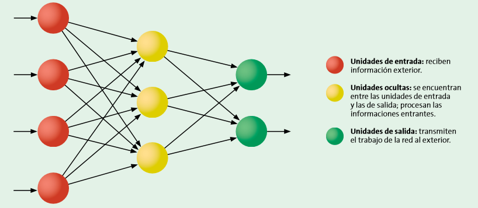
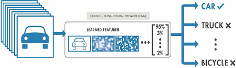

```{r setup, include=FALSE}
options(htmltools.dir.version = FALSE)
library(xaringanthemer)
solarized_dark(
  code_font_family = "Fira Code",
  code_font_url    = "https://cdn.rawgit.com/tonsky/FiraCode/1.204/distr/fira_code.css"
)
```

class: inverse, center, middle

# ¿Qué es Inteligencia Artificial?

---
class: center, middle


---
class: center, middle

j
---
class: inverse, center, middle
# ¿Qué es Inteligencia?

---

# Más allá del concepto

Las mediciones determinan la posición del individuo en la población en función de la edad y su desempeño.


--

Ni siquiera es estable en el tiempo.

---
# Más allá del concepto

### Primera Guerra Mundial 

 - test army α
 - test army β

--
 
Avances en algebra matricial y analisis factorial. Correlación, un factor general G, y tantos como factores se midan

---
# Más allá del concepto

### Segunda Guerra Mundial.

 - Baterias de aptitud múltiple o pruebas diferenciales que miden factores mucho más específicos para tareas especializadas de modo que se pueden seleccionar pilotos, artilleros, operadores de radio...

--

 - Army Standard Scores: Aircrew classification battery + Army general classification + Armed forces qualification test


---
# Problemas

  - Sesgos Culturales

--

  - Racismo?
  
--
  
  - Conformismo Social
  
--

### Paradojas de la Guerra ......

---

## El Concepto

 - Jerry Fodor y la Modularidad fisiológica (1980): 
                parece que existen módulos específicos por tarea.
 .pull-right[] 

---

## El Concepto

 - Howard Gardner y las Inteligencias múltiples (1983):
 
    Lengua, matemática, espacial, musical, cinestésica, intrapersonal/interpersonal, +naturalista
    
  .pull-right[] 

---

## El Concepto

 - Daniel Goleman: 
        inteligencia emocional (1995), social y ecológica
 
   .pull-right[]
   
---
class: inverse, center, middle
## Paradoja de la Inteligencia

**_Sí el cerebro fuese tan sencillo como para que lo pudiésemos comprender seríamos tan estúpidos que seríamos incapaces de hacerlo_**

---
class: inverse, center, middle

# Entonces...
# ¿Qué es Inteligencia Artificial?

---
## ¿Qué es Inteligencia Artificial?

 - La respuesta que demos estara siempre condicionada por el proposito, la ideologia y los temores.

---
## ¿Qué es Inteligencia Artificial?

- Conferencia de Darthmouth en 1956 (**_McCarthy, Minsky, Shannon y Rochester_**)


---
## ¿Qué es Inteligencia Artificial?

 -  Podemos hacer el camino a la inversa: ¿Qué existe que se adapte a lo que consideramos inteligencia?
 
---
## Capacidad Matemática

   .pull-right[] 

---
## Capacidad Matemática


---
## Capacidad Matemática


---
## Capacidad Linguística

 - Reconocimiento del texto escrito
 
--

 - Clasificacion de los documentos por temas
 
--

 - Analisis del sentimiento del discurso
 
--

 - Gramática Generativa: Creación de discurso inteligible


---
## Capacidad Espacial

_DARPA Grand Challenge (2004): 1 millón de dólares. Ruta de 180 kilómetros por terreno accidentado. NInguno pasó de 10 Km. Al año siguiente lo lograron 5_


---
class: center, middle


---
## Capacidad Espacial


.footnote[
[1] Self Driven Cars taught by poor kenyans] https://www.bbc.co.uk/news/amp/technology-46055595
---
## Capacidad Cinestésica


.footnote[
[2] Boston Dynamics. Atlas Parkour]https://www.youtube.com/watch?v=QCTSrJscmBg

---
## Capacidad Cinestésica


.footnote[
[3] Boston Dynamics. Atlas BackFlip]https://www.youtube.com/watch?v=fRj34o4hN4I

---
## Objeción

 - Hacen aquello para lo que han sido programados.
 
--
 
 - No presentan creatividad. No tienen capaciad de crear algo nuevo.

---
## Capacidad Musical


.footnote[
[4] Deep Bach] https://www.abc.es/tecnologia/informatica/abci-inteligencia-artificial-crea-musica-estilo-bach-201801242152_noticia.html

---
## Capacidad Artística


.footnote[
[5] Rembrandt IA] https://es.gizmodo.com/una-inteligencia-artificial-pinta-un-nuevo-cuadro-de-re-1769869684

---
## Capacidad Artística


.footnote[
[6] La IA planta cara al arte] https://elpais.com/cultura/2018/10/26/actualidad/1540577952_910752.html

---
## Objeción

 - No aprenden por sí solos.
 
--
 
 - Solamente "imitan".

---
## Aprendizaje autónomo

**Alpha Go / Alpha Zero**


---
# Alpha Go

 - Set de Training de Alpha Go v1= 30 millones de partidas (1 mes)
 
--

 - Set de Training de Alpha Go v2=  5 millones de partidas (70 horas)

--
 
 - **Go Zero : **
    - **sin set de training. Jugaba contra sí mismo. (4 horas)**

---
# Redes Neuronales


---
# Redes Neuronales

.pull-left[] .pull-right[]


---
# Redes Neuronales


---
# Redes Neuronales


---
class: inverse, middle, center

**_Métodos estadísticos simples con suficiente volumen de datos, son capaces de aparentar comprensión e intuición._**

---
class: middle, center


---
# Palomas Expertas

 - Una paloma consigue el 80% de accuracy en un mes. Un enfermero tarda 6 meses de entrenamiento.

--

 - Un cluster de palomas consigue el 99%.
 

Más referencias: 

https://www.youtube.com/watch?v=OWUDqmlY19A

https://www.slideshare.net/juantomas/databeers-madrid-2017-paas-pigeons-as-a-service

https://journals.plos.org/plosone/article?id=10.1371/journal.pone.0141357

---
class: inverse, middle, center
# Paradoja de la Inteligencia Artifical

**Cuando algo que se considera Inteligencia Artificial, es alcanzado, deja de considerarse Inteligencia Artificial**

---
# La Singularidad

**_“Actualmente, las máquinas resuelven problemas de acuerdo con los principios que hemos establecidos en ellas. Dentro de poco quizá aprendamos a ponerlas a trabajar en problemas específicos de mejorar su capacidad de resolver problemas. Una vez traspasado cierto umbral, esto nos llevaría a una espiral de aceleración y sería difícil perfeccionar un regulador fiable para refrenarlo”._**

                                                              Marvin Minsky
 
---
# Principio antropico fuerte aplicable a la inteligencia artificial

creemos que las máquinas inteligentes si lo son deben serlo como nosotros pero este mismo hecho nos aterroriza a algunos/muchos.

Una máquina que juega muy bien al ajedrez es solamente una máquina que juega muy bien al ajedrez

 El chatbot nazi
Pero si son no humanas....moral...leyes de la robótica asimovianas

Al revés. El cerebro en la máquina. Será humano?
