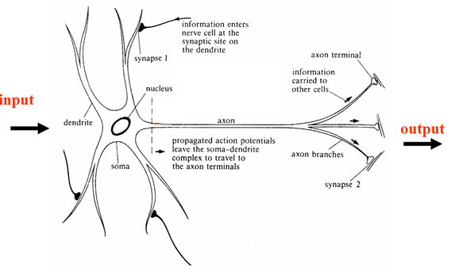
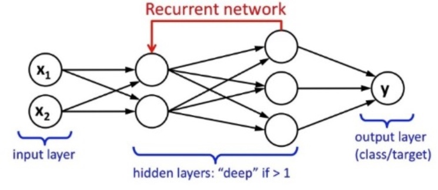

```{r setup, include=FALSE}
options(htmltools.dir.version = FALSE)
library(xaringanthemer)
solarized_dark(
  code_font_family = "Fira Code",
  code_font_url    = "https://cdn.rawgit.com/tonsky/FiraCode/1.204/distr/fira_code.css"
)
```

class: inverse, center, middle

# ¿En qué pensamos al hablar de Inteligencia Artificial?

---
background-image: url(media/terminatorbig.jpg)
background-position: 50% 50%
class: center, bottom

---
background-image: url(media/herpek.jpg)
background-position: 50% 50%
class: center, bottom
# Her

---
class: inverse, center, middle
# ¿Qué es Inteligencia?

---

# Más allá del concepto


---
# Más allá del concepto

### Primera Guerra Mundial 

 - test army α

 - test army β

---
# Más allá del concepto

### Segunda Guerra Mundial.

`Avances en matemática`: 

Álgebra matricial y analisis factorial = factor G, y tantos como factores se midan

--

 - Baterias de aptitud múltiple o pruebas diferenciales.
 
--

 - Army Standard Scores: pilotos, artilleros, operadores de radio...


---
# Críticas

  - Sesgos Culturales

  - Racismo

  - Conformismo Social
  
--

### Paradojas de la Guerra ......

---

## El Concepto

 - Jerry Fodor y la `Modularidad fisiológica` (**1980**): 
              
 .pull-right[] 

---

## El Concepto

 - Howard Gardner y las `Inteligencias múltiples` (**1983**):
 
   .pull-right[] 
  Lengua, 
  
    matemática,
    
    espacial,
    
    musical,
    
    cinestésica,
    
    intrapersonal/interpersonal,
    
    +naturalista
---

## El Concepto

 - Daniel Goleman: 
        inteligencia emocional (**1995**), social y ecológica
 
   .pull-right[]
   
---
class: inverse, center, middle
## Paradoja de la Inteligencia

**_Sí el cerebro fuese tan sencillo como para que lo pudiésemos comprender seríamos tan estúpidos que seríamos incapaces de hacerlo_**

---
class: inverse, center, middle
## Paradoja

**_"Somos emociones, y tenemos personas."_**

                       Mariano Rajoy

         
---
class: inverse, center, middle

# Entonces...
# ¿Qué es Inteligencia Artificial?


### ¿Cuándo queda fijado el concepto de IA tal y cómo lo entendemos hoy?

---
## ¿Qué es Inteligencia Artificial?

- (1956) Conferencia de Darthmouth (**_McCarthy, Minsky, Shannon y Rochester_**) Financia Rockefeller


---
## ¿Qué es Inteligencia Artificial?

 - La respuesta que demos estara siempre condicionada por el **proposito**, la **ideologia** y los **temores**.
 
 .

---
## Hagamos el camino inverso

### `¿Qué existe HOY que se ajuste a lo que consideramos inteligencia?`
 
---
## Capacidad Matemática

 .pull-left[]
 
  .pull-right[]
  
 .pull-right[]


---
## Capacidad Linguística

 - Reconocimiento del texto escrito
 - Reconocimiento + Traducción
 
  
   
---
## Capacidad Linguística

 - Reconocimiento del texto escrito
 - Reconocimiento + Traducción
 - Clasificacion de los documentos por temas
 
--

 - Analisis del sentimiento del discurso
 

  
---
## Capacidad Linguística

 - Gramática Generativa: Creación de discurso inteligible (ChatBots)
 


---
## Capacidad Espacial

_DARPA Grand Challenge (2004): 1 millón de dólares. Ruta de 180 kilómetros por terreno accidentado. NInguno pasó de 10 Km. Al año siguiente lo lograron 5_


---
class: center, middle


---
## Capacidad Espacial


.footnote[
[1] Self Driven Cars taught by poor kenyans] https://www.bbc.co.uk/news/amp/technology-46055595
---
## Capacidad Cinestésica

--


.footnote[
[2] Boston Dynamics. Atlas Parkour]https://www.youtube.com/watch?v=QCTSrJscmBg

---
## Capacidad Cinestésica


.footnote[
[3] Boston Dynamics. Atlas BackFlip]https://www.youtube.com/watch?v=fRj34o4hN4I

---
## Objeción

 - Hacen aquello para lo que han sido programados.
 
--
 
 - No presentan creatividad. No tienen capaciad de crear algo nuevo.

---
## Capacidad Musical


.footnote[
[4] Deep Bach] https://www.abc.es/tecnologia/informatica/abci-inteligencia-artificial-crea-musica-estilo-bach-201801242152_noticia.html

---
## Capacidad Artística


.footnote[
[5] Rembrandt IA] https://es.gizmodo.com/una-inteligencia-artificial-pinta-un-nuevo-cuadro-de-re-1769869684

---
## Capacidad Artística


.footnote[
[6] La IA planta cara al arte] https://elpais.com/cultura/2018/10/26/actualidad/1540577952_910752.html

---
## Objeción

 - No aprenden por sí solos.
 
--
 
 - Solamente "imitan".

---
## Aprendizaje autónomo

**Alpha Go / Alpha Zero**


---
# Alpha Go

 - Set de Training de Alpha Go v1= 30 millones de partidas (1 mes)
 
--

 - Set de Training de Alpha Go v2=  5 millones de partidas (70 horas)

--
 
 - **Go Zero : **
    - **sin set de training. Jugaba contra sí mismo. (4 horas)**


---
class: center, middle
# Todo esto se ha conseguido gracias a....

---
# Redes Neuronales

¿Cómo podemos entender cómo funciona un cerebro real?




McCulloch y Pitts (1943) postulan la posibilidad de que modelar matemáticamente el cerebro pudiese conducir a avances en el tratamiento de trastornos psiquiátricos. (No existen computadoras programables en ese momento.)

---
# Redes Neuronales
 - 86 mil millones de neuronas 
 - 8 tipos según diversa química
 - 6 tipos según morfología y funcionalidad (hasta 27 tipos según otras clasificaciones)


---
# Redes Neuronales


---
class: inverse, middle, center
# ¿Cómo hemos trasladado lo biológico a lo artificial?

---
# Redes Neuronales

**DNN**


--

Textos e Imágenes. Muy pesada.

---
# Redes Neuronales

**CNN**


--

Detección de patrones. Procesamiento de imágenes.

---
# Redes Neuronales

**RNN**




--

Datos secuenciales (texto, series temporales: bolsa)

---
# Redes Neuronales

**GANs**


---
# Redes Neuronales


---
class: inverse, middle, center

**_Métodos estadísticos simples con suficiente volumen de datos, son capaces de aparentar comprensión e intuición._**


---
class: inverse, middle, center
# Paradoja de la Inteligencia Artifical

**Cuando algo que se considera Inteligencia Artificial, es alcanzado, deja de considerarse Inteligencia Artificial**

---
# Las palabras no son innocentes

 - Si en lugar de IA, McCarthy hubiese utilizado `Procesamiento simbólico`, `Computación analítica`, o cualquier otra expresión, no estaríamos hablando de esto.
 
--

 - Aviones vs. Pájaros mecánicos o submarinos


--
### Importante:
- En la dicotomía `razonamiento simbólico vs. Machine Learning` el énfasis de la IA se ha puesto en el segundo cuando pensar es más cercano a lo primero.

---
class: inverse, middle, center
# Sin embargo....

---
class: middle, center


---
# Palomas Expertas

 - Una paloma consigue el 80% de accuracy en un mes. Un enfermero tarda 6 meses de entrenamiento.

--

 - Un cluster de palomas consigue el 99%.
 

Más referencias: 

https://www.youtube.com/watch?v=OWUDqmlY19A

https://www.slideshare.net/juantomas/databeers-madrid-2017-paas-pigeons-as-a-service

https://journals.plos.org/plosone/article?id=10.1371/journal.pone.0141357

---
# Sin embargo....


---
# Sin embargo....


                                                            
---
# Cuestiones y provocaciones


---
# Cuestiones y provocaciones

- **¿Puede una IA ser más inteligente que un ser humano?**

 - Si, ya lo son pero en formas restringidas.

--

- **¿Pero es lo mismo?**

   - Y si el resultado final es el mismo, ¿importan algo las diferencias?

--


- **¿Tienen o tendrán mente?** (IA “fuerte” frente a IA “débil”)

 - Depende de las creencias que tenemos sobre nosotros mismos, por ejemplo ¿los eventos mentales son de algún modo distintos e independientes del mundo físico (`dualismo`)?

--

 - Si el cerebro es una maquina biológica que manipula símbolos, tampoco "piensa". Si pensamos nosotros, también lo hacen las computadoras. Mientras no podamos demostrar la conciencia, no podemos afirmar que las máquinas no la posean.

---
# Cuestiones y provocaciones

- **¿Puede tener libre albedrío una IA?**

--

El libre albedrío no debería ser predecible, pero lo es. `El cerebro toma decisiones antes de que la mente sea consciente`. 

Es una decisión personal creer en el libre albedrío.

--

- **¿Puede “sentir” una IA?**

Es sencillo construir un robot que muestre sensación de dolor, llore o diga que le duele. ¿siente dolor? ¿Pueden sentir las máquinas? ¿es importante? `¿Queremos que lo hagan?`

---
class: inverse, middle, center
# Consecuencias inmediatas....

---
# Efectos Jurídicos

- **¿Debería prohibirse a las entidades no humanas involucrarse en acuerdos y contratos?**

--

Lo hacen desde el emperador Bizantino Justiniano, en el siglo V (Corpus). 

Críticas sobre el sesgo (algoritmos para la concesión de hipotecas).
    
--

- **¿Se debe permitir que una IA posea bienes?**

--

Si afectan a bienes o personas deben tener recursos asociados para `compensar en caso de perjuicios`. 

Podrían en tal caso `adquirirse a sí mismas`.

--

 - **Administración de Justicia automatizada**

Un gran campo para la formalización. Ya existen en EEUU sistemas de ayuda a los jueces así como la clasificación de jurisprudencia y búsqueda de patrones.

---
# Efectos Jurídicos

- **¿Puede cometer un delito una IA?**

`¿es necesario tener conciencia moral para delinquir?` NO. 
Solamente **conocer las consecuencias y decidir entre acciones** en necesario. 

--

A los psicópatas bajo proceso se les juzga por el hecho de "saber" que hacían mal según los usos y costumbres, no si "sentían" lo que hacían.

--

`Ética computacional y agentes morales artificiales`. Es un reto tecnológico necesario (coches autónomos)

--

`A veces ser moral implica transgredir la norma`. Es crítico desarrollar e implementar regulaciones morales aplicables a una IA para guiar su comportamiento.

---
# Efectos Económicos

- **¿Nos quitarán el trabajo?**

--

La duda es la velocidad del cambio y las estrategias aplicadas para paliar sus efectos negativos.

Hace siglo y medio, todo el mundo vivía del trabajo en la tierra, mientras que actualmente en España solamente un 5% lo hace. Si hubiera sido de la noche a la mañana hubiera sido brutal.

--

La IA es sólo otro avance en la automatización. Pero su efecto es multiplicativo. Aproximadamente el 65% de los trabajos desaparecerán en las próximas décadas. Afecta menos a las labores intelectuales que las manuales, y mucho más a las rutinarias. (Estudio de la Universidad de Oxford https://www.bbc.com/mundo/noticias-38930099)

--

Nuestra economía está basada en el trabajo. Si este no es necesario......

---
# Especulaciones más allá...

**¿Será un problema una súper inteligencia fuera de control? **

Demasiado remoto y especulativo. Pero concentra mucha atención. Las máquinas podrán modificar sus objetivos pero esta capacidad estará limitada por el propósito de su diseño. Claro, que si su diseño es perpetuarse...

**¿Pueden volverse locas las IA?**

En realidad son peores los efectos secundarios no planificados. Veasé el **automóvil**. `Estupidez Artificial`.

**¿Podremos copiarnos a una computadora?**

Respondo con otra pregunta ¿seríamos nosotros mismos? ¿seguiremos experimentando dolor? ¿seguiríamos cosechando experiencias? ¿seguiríamos controlando nuestro patrimonio? ¿podríamos hacer el camino de vuelta a un cuerpo?

---
class: inverse, middle, center

**Creemos que las máquinas inteligentes, si lo son de veras, deben serlo como nosotros. En realidad no hay nada que indique que será así, pero de cualquiera de las maneras, nos esperan tiempos apasionantes.**

---
class: inverse, center, middle

# Gracias!


---
# Cuestiones y Provocaciones
**_“Actualmente, las máquinas resuelven problemas de acuerdo con los principios que hemos establecidos en ellas. Dentro de poco quizá aprendamos a ponerlas a trabajar en problemas específicos de mejorar su capacidad de resolver problemas. Una vez traspasado cierto umbral, esto nos llevaría a una espiral de aceleración y sería difícil perfeccionar un regulador fiable para refrenarlo”._**
                                                            Marvin Minsky
--
### La Singularidad, y otros "ismos"
**En el momento en que las máquinas se puedan "rehacer" a sí mismas. Se producirá la explosión de la inteligencia.** 

`Futurismo` (Ray Kurzweil), director de ingeniería de Google en 2012 supone que ocurrirá en 2045. Hasta ahora las mejoras han sido sobre todo en hardware y disponibilidad de datos en formato procesable. Poco probable a corto plazo, y será advertida antes.

`Transhumanismo`, diseñaremos repuestos para nuestros propios órganos. ¿qué porcentaje de repuestos nos alejará de la categoría humana?

---
background-image: url(media/exmachinapek.png)
background-position: 50% 50%
class: center, bottom
# Ex Machina
---
background-image: url(media/rfkpk.jpg)
background-position: 50% 50%
class: center, bottom
# Robot & Frank
 
---
# Algunos Logros

- La Universidad de California en Berkeley, usa técnicas de Machine Learning para leer mentes. (No Lie MRI)

- Terapia emocional con veteranos de guerra.

- Cuidado de ancianos (Japón), eliminación de plagas con minibots.

- Opportunity / Curiosity / Fukushima
